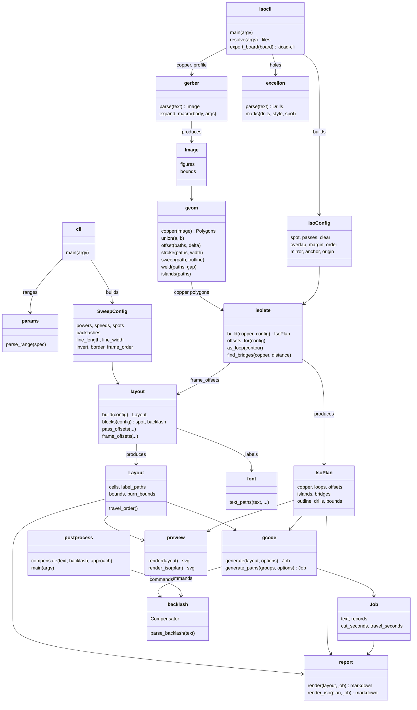

# Architecture

Three commands over one emitter. `gcode`, `backlash`, `preview` and `report`
are shared; the sweep builds its geometry, the isolation job reads it out of
a file.

```mermaid
classDiagram
    class cli {
        main(argv)
    }
    class isocli {
        main(argv)
        resolve(args) files
        export_board(board) kicad-cli
    }
    class postprocess {
        compensate(text, backlash, approach)
        main(argv)
    }
    class params {
        parse_range(spec)
    }
    class SweepConfig {
        powers, speeds, spots
        backlashes
        line_length, line_width
        invert, border, frame_order
    }
    class layout {
        build(config) Layout
        blocks(config) spot, backlash
        pass_offsets(...)
        frame_offsets(...)
    }
    class Layout {
        cells, label_paths
        bounds, burn_bounds
        travel_order()
    }
    class font {
        text_paths(text, ...)
    }
    class gerber {
        parse(text) Image
        expand_macro(body, args)
    }
    class Image {
        figures
        bounds
    }
    class excellon {
        parse(text) Drills
        marks(drills, style, spot)
    }
    class geom {
        copper(image) Polygons
        union(a, b)
        offset(paths, delta)
        stroke(paths, width)
        sweep(path, outline)
        weld(paths, gap)
        islands(paths)
    }
    class IsoConfig {
        spot, passes, clear
        overlap, margin, order
        mirror, anchor, origin
    }
    class isolate {
        build(copper, config) IsoPlan
        offsets_for(config)
        as_loop(contour)
        find_bridges(copper, distance)
    }
    class IsoPlan {
        copper, loops, offsets
        islands, bridges
        outline, drills, bounds
    }
    class gcode {
        generate(layout, options) Job
        generate_paths(groups, options) Job
    }
    class Job {
        text, records
        cut_seconds, travel_seconds
    }
    class backlash {
        Compensator
        parse_backlash(text)
    }
    class preview {
        render(layout) svg
        render_iso(plan) svg
    }
    class report {
        render(layout, job) markdown
        render_iso(plan, job) markdown
    }

    cli --> params : ranges
    cli --> SweepConfig : builds
    SweepConfig --> layout
    layout --> Layout : produces
    layout --> font : labels
    Layout --> gcode
    Layout --> preview
    Layout --> report

    isocli --> gerber : copper, profile
    isocli --> excellon : holes
    isocli --> IsoConfig : builds
    gerber --> Image : produces
    Image --> geom
    geom --> isolate : copper polygons
    IsoConfig --> isolate
    isolate --> IsoPlan : produces
    IsoPlan --> gcode
    IsoPlan --> preview
    IsoPlan --> report

    gcode --> Job
    gcode --> backlash : commands
    postprocess --> backlash : commands
    Job --> report
    isolate --> layout : frame_offsets
```
